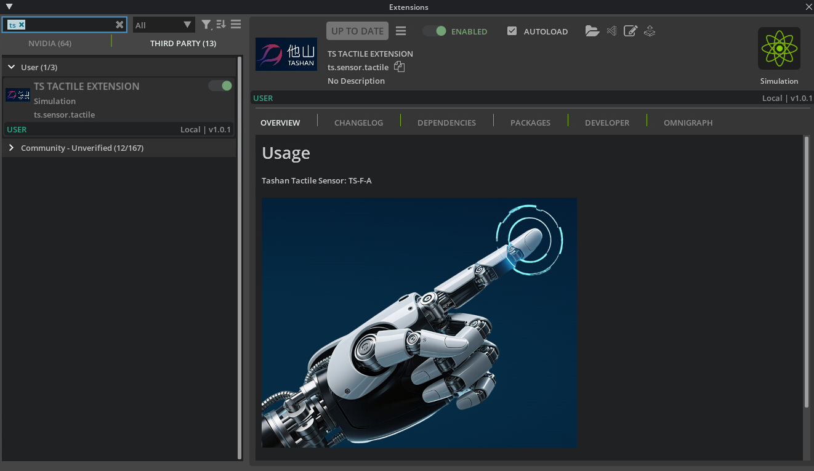

# 他山科技触觉模拟仿真平台使用手册

[English](README.md) | [中文](README_zh.md)

## 简介
欢迎使用他山科技触觉模拟仿真平台！本平台基于 Isaac Sim 开发，旨在为研究人员和开发者提供一个高效、精准的机器人触觉模拟环境，助力机器人触觉感知技术的研究与创新。我们的模型是国内首个基于真实产品的触觉模拟仿真模型，对推动具身智能机器人的发展具有重要意义。<br>


## 功能概述
- 通用触觉传感器 TS-F-A，输出11维特征通道：
    - 接近觉[1]；

    - 触觉[2~4]: 法向力、切向力、切向力方向（0-359度，指尖方向为0）；

    - 原始电容值[5~11]: 7个压力通道原始电容值。


## 工作站设置
在开始使用本平台之前，请检查您的系统是否满足 [Isaac Sim Requirements](https://docs.isaacsim.omniverse.nvidia.com/5.0.0/installation/requirements.html)。
- 项目基于isaac sim 5.0.0版本，下载 [Download Isaac Sim 5.0.0](https://docs.isaacsim.omniverse.nvidia.com/5.0.0/installation/download.html)；

- 工作站安装 [Workstation Installation](https://docs.isaacsim.omniverse.nvidia.com/5.0.0/installation/install_workstation.html)；
    ```bash
    # 安装可视化依赖
    cd <isaacsim>
    ./python.sh -m pip install rerun-sdk==0.18.2
    ```

- 下载资产包 [Local Assets Packs](https://docs.isaacsim.omniverse.nvidia.com/4.5.0/installation/install_faq.html#isaac-sim-setup-assets-content-pack)，在本地和离线环境中使用。

## 使用指南
在使用TS TACTILE 扩展之前, 建议先使用的Isaac Sim 在线文档 [Extension Template Generator](https://docs.isaacsim.omniverse.nvidia.com/5.0.0/utilities/extension_template_generator.html)，学习了解如何生成和使用扩展。

1. 激活TS TACTILE 扩展
    在顶部菜单栏中，点击Window -> Extension 显示扩展管理器，在搜素栏中输入"TS TACTILE EXTENSION"搜索扩展，点击ENABLED 开关以激活扩展，在ubuntu22.04 已验证。<br>
    如果您找不到 TS TACTILE 扩展，那么您可以通过克隆本项目来手动添加它：
    ```bash
    cd <your_workspace>
    git clone git@github.com:TashanTec/Tashan-Isaac-Sim.git
    ```
    单击菜单按钮（三个水平条），选择 Settings ，然后在右侧列表中创建一个新目录，添加 your_workspace 文件夹路径。
    再在搜索栏中搜索 "TS TACTILE EXTENSION"，激活扩展；如果您希望仿真平台启动时加载扩展，点击标记 AUTOLOAD 选项。
    <br>

2. 测试 TS TACTILE 扩展：
    - LOAD ：点击LOAD 按钮，加载 TS-F-A 触觉传感器模组及小卡片，并同时启动数据可视化窗口；

    - RESET ：点击RESET 按钮，恢复到初始状态；

    - RUN ：点击RUN 按钮，命令行终端会实时输出 TS-F-A 触觉传感器数据，小卡片会自由落体到触觉传感器模组上；

    - STOP ： 点击STOP 按钮，仿真停止；并绘制传感器触觉数据变化时序图，以验证模型的准确性和稳定性。


## 应用场景与示例

1. 触觉感知研究：利用本平台，研究人员可以开展触觉感知算法的研究，如触觉信号处理、特征提取、物体识别等。

2. 机器人操作任务模拟：通过模拟灵巧手的触觉感知和操作过程，开发和优化机器人操作任务的策略和算法，提高机器人在复杂任务中的表现。

3. 多模态感知融合：将触觉感知与视觉、听觉等其他感知模态进行融合，实现更全面、更准确的环境感知和物体理解。


## 常见问题解答

1. Q：启动仿真，加载场景时间过长或失败。<br>
A：主要是网络问题，建议下载资产包到本地，修改配置作为本地资产，本地资产加载速度比云端快10-100倍。

2. Q：如何在自己的模型中添加触觉传感器？<br>
A：先将触觉传感器模组的 usd 文件导入模型中，记住 prim_path路径，在 ts.sensor.tactile/ts_tactile_extension_python/scenario.py 文件中 range_paths 和 _touch 变量中添加路径。


## 贡献与反馈

我们欢迎全球范围内的生态伙伴共同参与本平台的训练与优化，贡献各自的技术力量和创意。如果您在使用过程中发现任何问题或有任何建议，欢迎通过以下方式与我们联系：
GitHub 仓库：在我们的[https://github.com/TashanTec/Tashan-Isaac-Sim.git] 提交问题。<br>
邮箱 ：您也可以通过发送邮件至[zhangrun@tashantec.com] 与我们联系。